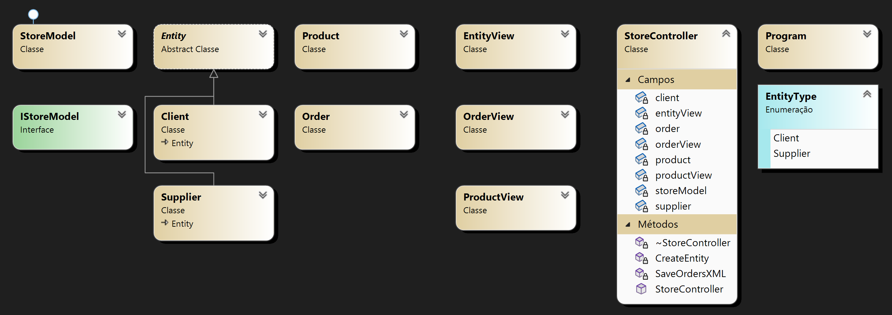

# trabalhoPOO_6160 - LESI - IPCA
Projeto desenvolvido para a disciplina de Programação Orientada a Objetos. 

Esta disciplina faz parte do segundo ano curricular da Licenciatura em Engenharia de Sistemas Informáticos.

## Contextualização do Trabalho
Com a execução deste trabalho, pretende-se a consolidação dos conhecimentos na linguagem de programação C#, adquiridos durante as aulas.

Como tal será necessário desenvolver um sistema que permita a gestão de uma loja online.

### Tópicos a explorar durante a execução do trabalho
- Qualidade do código produzido: estrutura da solução, ficheiros, uso de bibliotecas, Norma CLS
- Organização e Implementação das Classes com recurso a Interfaces, Herança ou classes abstratas
- Qualidade dos algoritmos aplicados
- Estruturas de dados exploradas
- Tratamento adequado de exceções
- Persistência de dados com recurso a ficheiros
- Exploração de outras valências: Lambda Functions; LINQ; MVC; WPF

### Diagrama de Classes
A imagem seguinte mostra o Diagrama de Classes.

## Controlo de Versão
Versão 1.0 – Fase 1 de Entrega (17-11-2021)
- Diagrama de classes;
- Implementação essencial das classes;
- Estruturas de dados a utilizar;
- Relatório do trabalho desenvolvido até à data.

Versão 2.0 – Fase 2 de Entrega (31-12-2021)
- Versão 2 do Diagrama de classes;
- Implementação de novas classes;
- Implementação de métodos;
- Implementação do padrão MVC;
- Criação da Documentação com o Doxygen.
